# Learn Git Branching - Documentación de niveles

**Plataforma:** [Learn Git Branching](https://learngitbranching.js.org/?locale=es_ES)
**Alcance:** 34 niveles (18 de `Main` + 16 de `Remote`), según enumeración del laboratorio consultada el 25 de agosto de 2026.

---

## Sección Main

### M1.1 - Introduction to Git Commits

**Objetivo:** Practicar el comando básico para crear commits. Cada commit representa una fotografía (snapshot) del estado del repositorio en un momento dado.

**Estado inicial:** Repositorio vacío con un único commit `C0`.

| Paso | Comando | Efecto sobre el repositorio |
|---:|---|---|
| 1 | `git commit` | Crea un nuevo commit `C2` que apunta a `C1` como padre. `HEAD` y la rama `main` avanzan a `C2`. |
| 2 | `git commit` | Crea un nuevo commit `C3` que apunta a `C2` como padre. `HEAD` y `main` avanzan a `C3`. |

**Estado final:** El historial queda como `C0 -> C1 -> C2 -> C3`, con `main` y `HEAD` apuntando a `C3`. Se cumple el objetivo de crear dos commits nuevos.

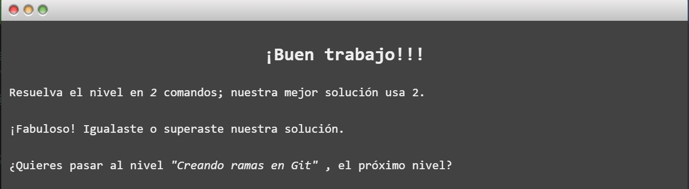

**Aprendizaje:** Se aprendio a realizar un commit basico en git y como se ve en el historial

---

### M1.2 - Branching in Git

**Objetivo:** Aprender a crear una rama nueva.

**Estado inicial:** Un commit `C1` con `main` y `HEAD` apuntando a él.

| Paso | Comando | Efecto sobre el repositorio |
|---:|---|---|
| 1 | `git branch bugFix` | Crea la referencia `bugFix` apuntando al mismo commit que `main` (`C1`). `HEAD` sigue en `main`. |
| 2 | `git checkout bugFix` | Mueve `HEAD` para que apunte a la rama `bugFix`. |

**Estado final:** Dos ramas convergentes: `main` en `C1` y `bugFix` en `C1`. `HEAD` apunta a `bugFix y main`.

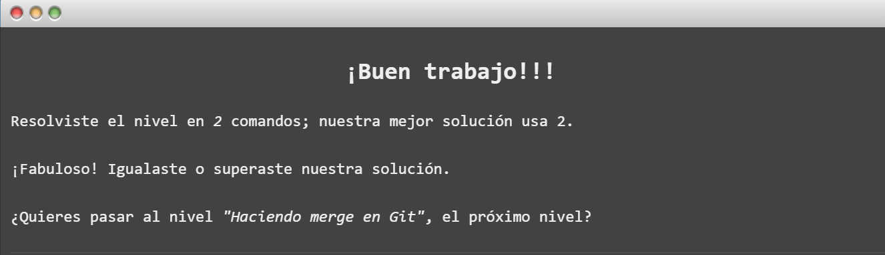

**Aprendizaje:** Se aprendio la base para crear ramas

---

### M1.3 - Merging in Git

**Objetivo:** Combinar el trabajo de dos ramas mediante un commit de fusión (merge) que conserve ambos historiales.

**Estado inicial:** `main` en `C1`; se debe crear y avanzar `bugFix`.

| Paso | Comando | Efecto sobre el repositorio |
|---:|---|---|
| 1 | `git checkout -b bugFix` | Crea la rama `bugFix` en `C1` y mueve `HEAD` a ella en un solo paso. |
| 2 | `git commit` | Crea `C2` sobre `bugFix`. |
| 3 | `git checkout main` | Regresa `HEAD` a la rama `main` (que sigue en `C1`). |
| 4 | `git merge bugFix` | Crea un commit de fusión `C3` con dos padres (`C1` desde `main` y `C2` desde `bugFix`). `main` avanza a `C3`. |

**Estado final:** `main` apunta a `C3`, un commit de fusión con dos padres; `bugFix` permanece en `C2`.

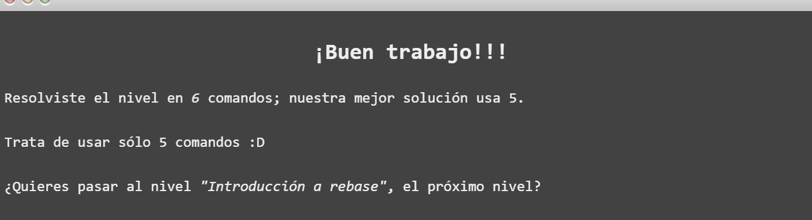

**Aprendizaje:** Se adquirieron las bases para ir entendiendo lo que es mergear

---

### M1.4 - Rebase Introduction

**Objetivo:** Aprender el principio basico del comando rebase en git

**Estado inicial:** `main` en `C1`; se crearán commits divergentes en `bugFix` y en `main`.

| Paso | Comando | Efecto sobre el repositorio |
|---:|---|---|
| 1 | `git checkout -b bugFix` | Crea y cambia a la rama `bugFix` en `C1`. |
| 2 | `git commit` | Crea `C2` sobre `bugFix`. |
| 3 | `git checkout main` | Vuelve a `main` (en `C1`). |
| 4 | `git commit` | Crea `C3` sobre `main`; ahora `main` y `bugFix` divergen desde `C1`. |
| 5 | `git checkout bugFix` | Cambia `HEAD` a `bugFix`. |
| 6 | `git rebase main` | Recrea el commit `C2` como `C2'` con padre `C3`, colocando `bugFix` "encima" de `main`. El historial queda lineal. |

**Estado final:** `bugFix` apunta a `C2'` (copia de `C2`) cuyo padre es `C3`. `main` permanece en `C3`.

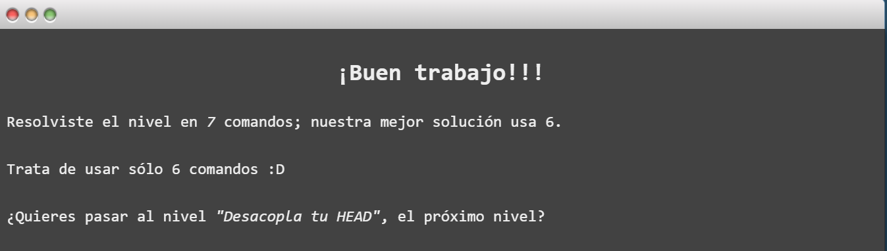

**Aprendizaje:** Se comprendio como juntar el trabajo de varias ramas

---

### M2.1 - Detach yo' HEAD

**Objetivo:** Comprender qué significa mover `HEAD` directamente a un commit en lugar de a una rama (HEAD separado / *detached HEAD*).

**Estado inicial:** Historial lineal `C0 -> C1 -> C2 -> C3 -> C4`, con `main` en `C4`.

| Paso | Comando | Efecto sobre el repositorio |
|---:|---|---|
| 1 | `git checkout C4` | Mueve `HEAD` directamente al commit `C4` (usando su identificador), sin pasar por una rama. `HEAD` queda "separado": ya no sigue a `main`. |

**Estado final:** `HEAD` apunta directamente a `C4`, mientras que `main` también apunta a `C4` pero como referencia independiente. Si se hiciera un commit nuevo en este estado, quedaría fuera del alcance de cualquier rama a menos que se cree una.

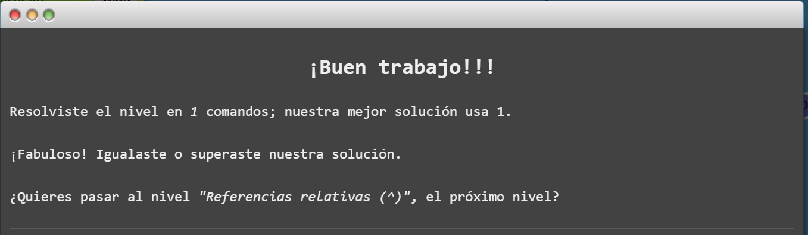

**Aprendizaje:** Se comprendio como funciona el HEAD y como moverlo a un commit en particular

---

### M2.2 - Relative Refs (^)

**Objetivo:** Practicar el uso de referencias relativas (`^`) para moverse por el árbol sin escribir identificadores de commit completos.

**Estado inicial:** Historial lineal con varios commits, `HEAD` apuntando a C3.

| Paso | Comando | Efecto sobre el repositorio |
|---:|---|---|
| 1 | `git checkout main^` | `Mueve la rama bugFix un commit detras de HEAD`

**Estado final:** `HEAD` en medio de main y bugFix

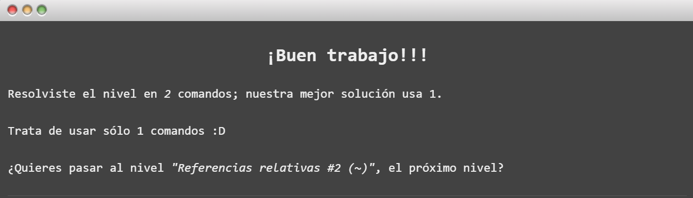

**Aprendizaje:** Se aprendio a trasladar las ramas utilizando del ^

---

### M2.3 - Relative Refs #2 (~)

**Objetivo:** Combinar referencias relativas con el operador `~num` para saltar varios commits a la vez, y usar `git branch -f` para reubicar una rama.

**Estado inicial:** Historial lineal de varios commits; `main` en el commit más reciente.

| Paso | Comando | Efecto sobre el repositorio |
|---:|---|---|
| 1 | `git branch -f main   HEAD~3` | Fuerza a la rama `main` a apuntar tres commits atrás de `HEAD`, sin necesidad de cambiar de rama primero. |
| 2 | `git checkout HEAD~1` | Mueve `HEAD` (separado) un commit atrás de su posición actual. |

**Estado final:** `main` quedó reubicada tres commits atrás de su posición original; `HEAD` queda en estado separado en la posición solicitada por el nivel.

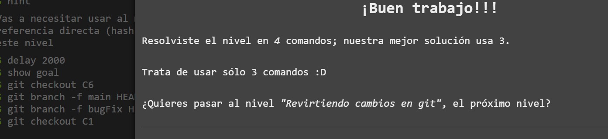

**Aprendizaje:** Se logro implementar las referencias relativas en conjunto con la bandera -f

---

### M2.4 - Reversing Changes in Git

**Objetivo:** Distinguir entre deshacer cambios localmente (`reset`) y deshacerlos de forma segura cuando ya fueron compartidos (`revert`).

**Estado inicial:** Dos ramas: `local` (no compartida) y `pushed` (que simula ya haberse compartido con un remoto).

| Paso | Comando | Efecto sobre el repositorio |
|---:|---|---|
| 1 | `git checkout local` | Cambia `HEAD` a la rama `local`. |
| 2 | `git reset HEAD~1` | Mueve la rama `local` un commit atrás; el commit anterior deja de estar en el historial de esa rama (se "elimina" la referencia a él, aunque el objeto persiste temporalmente). |
| 3 | `git checkout pushed` | Cambia `HEAD` a la rama `pushed`. |
| 4 | `git revert HEAD` | Crea un commit nuevo que aplica el cambio inverso del commit actual, sin eliminar el commit original del historial. |

**Estado final:** `local` retrocedió su puntero (historial reescrito localmente); `pushed` avanzó con un commit nuevo que anula el anterior, preservando la historia compartida.

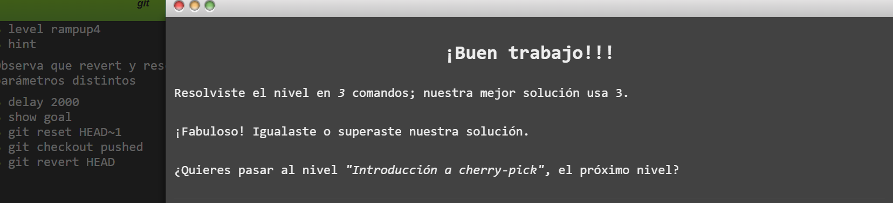

**Aprendizaje:** Se comprendio a la perfeccion la diferencia entre como deshacer cambios de forma local y remota

---

### M3.1 - Cherry-pick Intro

**Objetivo:** Traer commits específicos de otras ramas hacia la rama actual sin fusionar toda la rama.

**Estado inicial:** Varias ramas (`side`, `bugFix`, etc.) con commits divergentes respecto a `main`.

| Paso | Comando | Efecto sobre el repositorio |
|---:|---|---|
| 2 | `git cherry-pick C2 C4 C7` | Copia los commits `C2` , `C4` y `C7` 

**Estado final:** `main` gana copias de los commits seleccionados, sin alterar las ramas de origen ni traer commits no deseados.

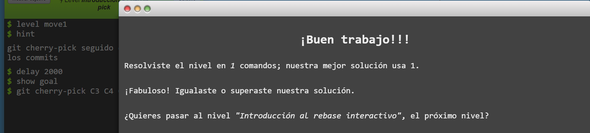

**Aprendizaje:** Se comprendio como tomar copias de ciertos commits sin fusionar todo

---

### M3.2 - Interactive Rebase Intro

**Objetivo:** Usar `rebase -i` para reordenar, editar o eliminar commits de forma interactiva antes de reaplicarlos.

**Estado inicial:** Una rama con varios commits en un orden que no corresponde al deseado.

| Paso | Comando | Efecto sobre el repositorio |
|---:|---|---|
| 1 | `git rebase -i overHere` | Abre el listado interactivo de los últimos cuatro commits, permitiendo reordenar líneas, marcar `drop` para eliminar, o `pick` para conservar. |
| 2 | (edición en el editor interactivo) | Se reordenan y/o eliminan las líneas necesarias; al guardar, Git reaplica los commits restantes en el nuevo orden, generando nuevos identificadores. |

**Estado final:** La rama queda con los commits deseados, en el orden correcto, como nuevos objetos commit (los originales quedan huérfanos).

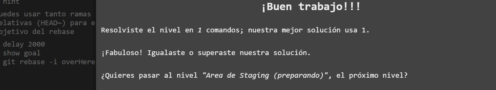

**Aprendizaje:** Se aprendio como agrupar commits en un orden conveniente

---

### M4.1 - Grabbing Just 1 Commit

**Objetivo:** Extraer un único commit útil de una rama con varios commits, descartando el resto.

**Estado inicial:** Rama  con varios commits; solo uno de ellos (por ejemplo `C4`) es relevante para `main`.

| Paso | Comando | Efecto sobre el repositorio |
|---:|---|---|
| 1 | `git rebase -i main` | se pone un panel para seleccionar el commit. |
| 2 | `git rebase bugFix main` | Copia únicamente el commit `C4` sobre `bugFix`. |

**Estado final:** `main` incorpora solo el cambio deseado, sin arrastrar commits intermedios no deseados.

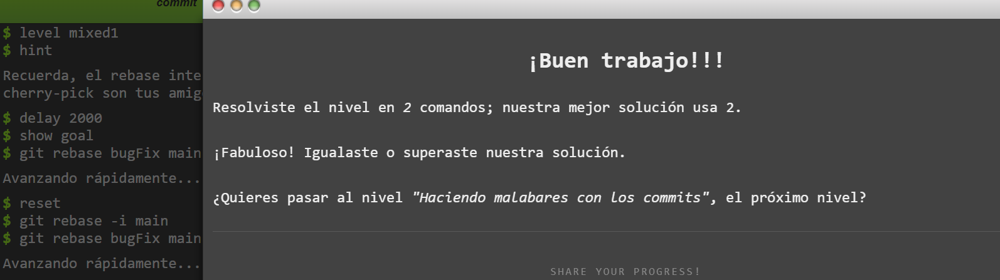

**Aprendizaje:** Se fortalecio lo aprendido sobre el rebase iterativo y el rebase normal

---

### M4.2 - Juggling Commits

**Objetivo:** Modificar un commit que no está en la punta de la rama utilizando rebase interactivo y `amend`.

**Estado inicial:** Rama `main` con commits `C1`, `C2`, `C3`, donde `C2` necesita un cambio.

| Paso | Comando | Efecto sobre el repositorio |
|---:|---|---|
| 1 | `git rebase -i HEAD~2` | Abre los últimos dos commits para edición interactiva. |
| 2 | `git commit --amend` | Modifica el contenido del commit detenido sin crear uno nuevo aparte. |
| 3 | `git rebase -i HEAD~2` | Se reacomodan los commits segun el orden requerido. |
| 4 | `git rebase caption main` | se fusiona hace el rebase final para cumplir el nivel. |

**Estado final:** La rama conserva la misma cantidad de commits, pero el commit intermedio queda corregido y todos los commits posteriores se recalculan con nuevos identificadores.

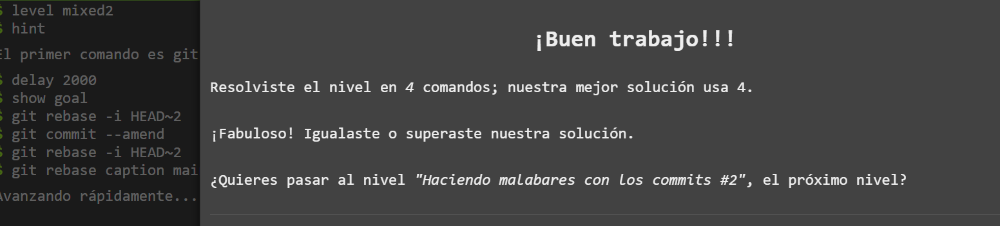

**Aprendizaje:** Se fortalecio el manejo de commits aprendido con anteriorida y la forma de tratar los mismos

---

### M4.3 - Juggling Commits #2

**Objetivo:** Resolver un caso similar al anterior, pero usando una estrategia alternativa (reset + cherry-pick) cuando el rebase interactivo no es la única vía.

**Estado inicial:** Rama con commits en un orden donde se debe reescribir uno intermedio y reordenar el resto.

| Paso | Comando | Efecto sobre el repositorio |
|---:|---|---|
| 1 | `git checkout main` | se pocisiona en la rama main. |
| 2 | `git cherry-pick C2` | se copia el commit en la rama actual. |
| 3 | `git commit --amend` | se modifica el commit. |
| 4 | `git cherry-pick C3` | se copia el commit nuevamente. |

**Estado final:** El historial de `main` refleja el commit corregido y conserva todos los commits necesarios en el orden correcto.

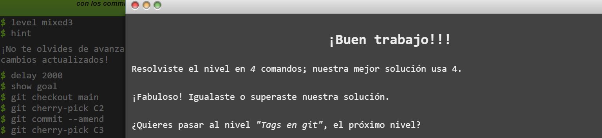

**Aprendizaje:** Se mejoro el manejo de los commits teniendo dificultades en el orden de los comandos por lo extenso del arbol

---

### M4.4 - Git Tags

**Objetivo:** Marcar un commit específico con una referencia permanente e inmutable (tag), útil para señalar versiones.

**Estado inicial:** Historial con varios commits, sin tags.

| Paso | Comando | Efecto sobre el repositorio |
|---:|---|---|
| 1 | `git tag v1 side~1` | Crea la referencia de tag `v1` apuntando al commit `C2`. |
| 2 | `git tag v1 side~1` | Crea la referencia de tag `v0` apuntando al commit `C1`. |
| 3 | `git checkout v1` | Se traslada al commit que tiene el tag `v1`. |

**Estado final:** los tags quedan fijos en los commits seleccionados y se pueden usar como identificador.

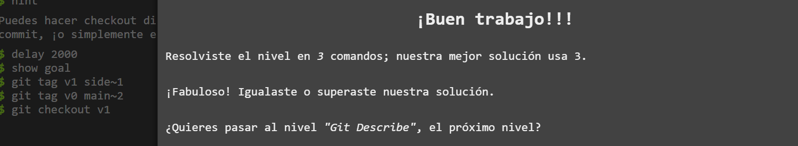

**Aprendizaje:** Se aprendio el principio basico de los tags en git y su utilidad en el repositorio.

---

### M4.5 - Git Describe

**Objetivo:** Usar `git describe` para ubicar un commit en relación con el tag más cercano en su historial ascendente.

**Estado inicial:** Historial con al menos un tag en un commit anterior y varios commits posteriores.

| Paso | Comando | Efecto sobre el repositorio |
|---:|---|---|
| 1 | `git commit` | Se genera el commit necesario en la rama bugFix para obtener la estructura deseada. |

**Estado final:** Se obtiene la descripción textual solicitada por el nivel para cada rama o commit indicado, sin alterar el árbol.

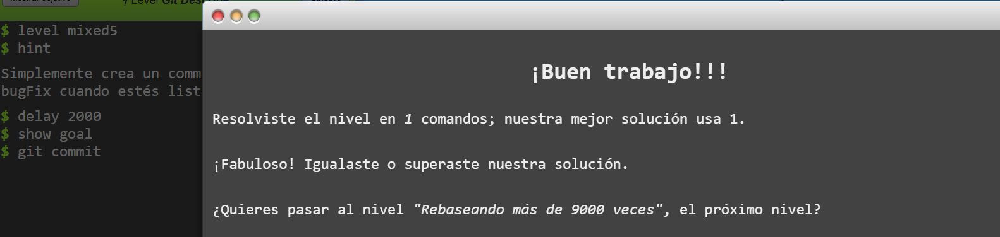

**Aprendizaje:** Se reconocio el valor de este nuevo comando para el manejo de los commit

---

### M5.1 - Rebasing over 9000 times

**Objetivo:** Encadenar varias operaciones de rebase para "aplanar" un conjunto de ramas divergentes en una sola línea de historia bajo `main`.

**Estado inicial:** Varias ramas (`bugFix`, `side1`, `side2`, etc.) que divergen sucesivamente unas de otras.

| Paso | Comando | Efecto sobre el repositorio |
|---:|---|---|
| 1 | `git rebase main bugFix` | Reaplica los commits de `bugFix` sobre `main`, y mueve el puntero de `bugFix` al resultado. |
| 2 | `git rebase main bugFix` | Reaplica `bugFix` sobre la nueva punta de `main`. |
| 3 | `git rebase bugFix side` | Reaplica `side` sobre la nueva punta de `bugFix`. |
| 4 | `git rebase side another` | Mueve `another` al extremo de toda la cadena reconstruida. |
| 5 | `git rebase another mian` | Finalmente se hace el rabase de todo a main. |

**Estado final:** Todas las ramas quedan encadenadas linealmente, y `main` incorpora el trabajo acumulado de todas ellas.

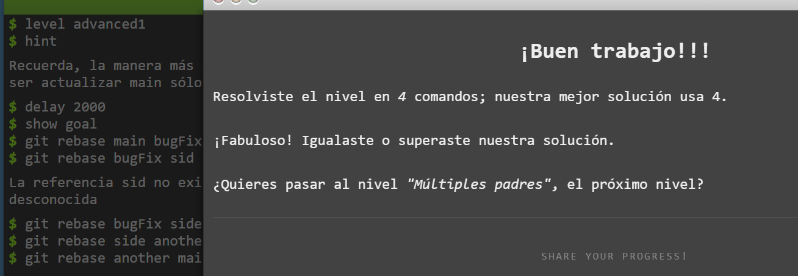

**Aprendizaje:** Se mejoro la forma de iterar sobre las rammas y sus posiciones

---

### M5.2 - Multiple Parents

**Objetivo:** Practicar la navegación hacia commits de fusión, que tienen más de un padre, combinando `^` con un número de padre y `~`.

**Estado inicial:** Historial que incluye al menos un commit de fusión con dos padres.

| Paso | Comando | Efecto sobre el repositorio |
|---:|---|---|
| 1 | `git checkout bugWork main^^2^` |Crea la rama bugWork que apunta a un commit en especifico. |

**Estado final:** `HEAD` queda ubicado exactamente en el commit solicitado por el nivel, en estado separado, demostrando comprensión de cómo Git recorre commits con múltiples padres.

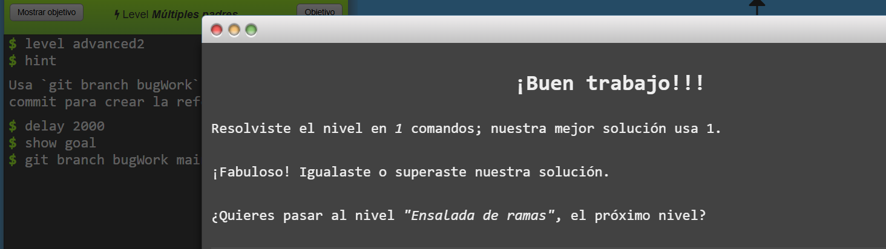

**Aprendizaje:** Se aorendio a crear y mover una rama de forma mas compleja y simultanea

---

### M5.3 - Branch Spaghetti

**Objetivo:** Resolver un árbol de ramas enredado, combinando rebase y cherry-pick para llevar el trabajo relevante de varias ramas hacia `main` y `caption`, según lo pida el nivel.

**Estado inicial:** Múltiples ramas cortas divergiendo en distintos puntos del historial, formando una estructura difícil de leer a simple vista.

| Paso | Comando | Efecto sobre el repositorio |
|---:|---|---|
| 1 | `git checkout one` | Se posiciona sobre la rama one. |
| 2 | `git cherry-pick C4 C3 C2` (identificadores según el árbol del nivel) | Copia commits puntuales necesarios desde otras ramas hacia `one` sin arrastrar todo su historial. |
| 1 | `git checkout two` | Se posiciona sobre la rama one. |
| 3 | `git cherry-pick C4 C3 C2` (identificadores según el árbol del nivel) | Se copian los commits en la rama two. |
| 4 | `git branch -f three C2` | Se fuerza a la rama three a apuntar a C2. | 

**Estado final:** El "espagueti" de ramas queda resuelto en una estructura clara donde `main` refleja todo el trabajo relevante, en el orden correcto.

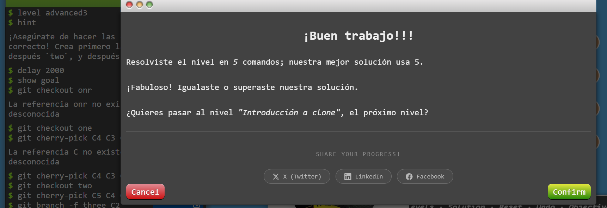

**Aprendizaje:** Se finalizo el aprendizaje local y se logro entender a profundidad como tratar a los commits.

---

## Sección Remote

### R1.1 - Clone Intro

**Objetivo:** Comprender que `clone` crea una copia local completa de un repositorio remoto, incluyendo su historial y una rama de seguimiento remoto.

**Estado inicial:** Un repositorio remoto `origin` con commits `C1`, `C2`, `C3`.

| Paso | Comando | Efecto sobre el repositorio |
|---:|---|---|
| 1 | `git clone` | (Simulado por la plataforma) Crea un repositorio local con copia del historial de `origin`, una rama local `main` y una rama de seguimiento remoto `o/main`. |

**Estado final:** El repositorio local queda sincronizado con `origin` en el momento del clon, con `o/main` reflejando el estado remoto observado.

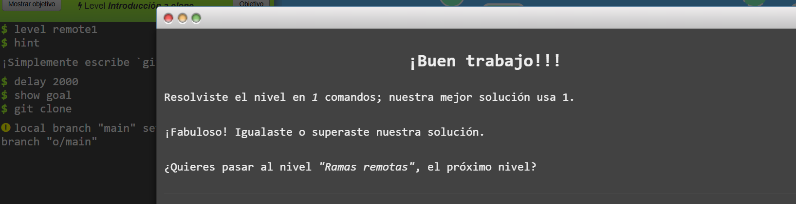

**Aprendizaje:** Se aprendio sobre el proceso de clonado para un repositorio remoto

---

### R1.2 - Remote Branches

**Objetivo:** Entender qué es una rama de seguimiento remoto (`o/main`) y cómo crear una rama local a partir de ella.

**Estado inicial:** Repositorio clonado con `o/main` apuntando al estado conocido de `origin`.

| Paso | Comando | Efecto sobre el repositorio |
|---:|---|---|
| 1 | `git commit` | Se crea un commit. |
| 2 | `git checkout o/main` | Se posiciona el HEAD en la rama remota seleccionada. |
| 1 | `git commit` | Se crea el commit final. |

**Estado final:** Se guardan los cambios locales en la rama remota mas reciente.

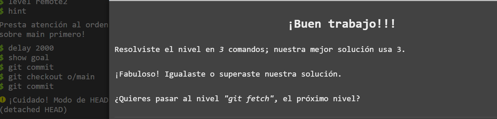

**Aprendizaje:** Se aprendio como moverse y actualizar los commit en ramas remotas

---

### R1.3 - Git Fetchin'

**Objetivo:** Descargar los cambios nuevos del remoto sin fusionarlos automáticamente con el trabajo local.

**Estado inicial:** El remoto `origin` avanzó más allá de lo que refleja `o/main` localmente.

| Paso | Comando | Efecto sobre el repositorio |
|---:|---|---|
| 1 | `git fetch` | Descarga los commits nuevos de `origin` y actualiza la rama de seguimiento remoto `o/main`, pero **no** modifica `main` ni el árbol de trabajo local. |

**Estado final:** `o/main` refleja el estado real y actual del remoto; `main` permanece sin cambios hasta que se decida integrarlos.

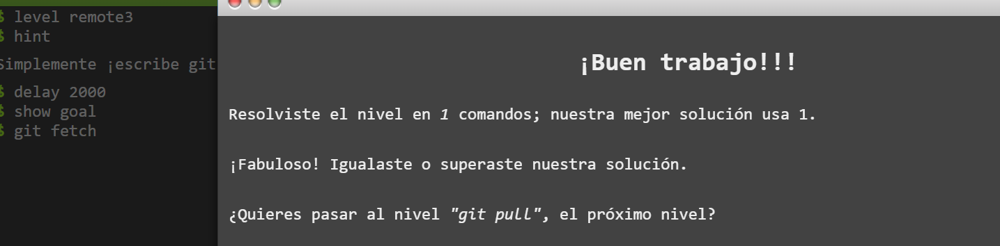

**Aprendizaje:** Se entendio el efecto del comando `fetch` en los repositorios de trabajo remoto evitando la fusion con lo local

---

### R1.4 - Git Pullin'

**Objetivo:** Combinar en un solo paso la descarga de cambios remotos y su integración en la rama local (`fetch` + `merge`).

**Estado inicial:** `origin` avanzó respecto al `o/main` local.

| Paso | Comando | Efecto sobre el repositorio |
|---:|---|---|
| 1 | `git pull` | Ejecuta internamente `git fetch` seguido de `git merge o/main`, actualizando tanto la rama de seguimiento remoto como la rama local activa. |

**Estado final:** `main` (o la rama activa) queda al día con `origin`, incorporando los commits nuevos mediante un merge (o fast-forward si no hubo divergencia).

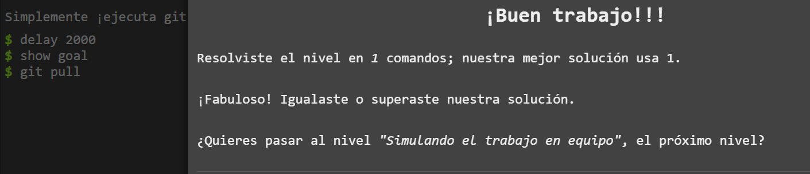

**Aprendizaje:** Se comprendio como realizar el proceso de refrescamiento de un repositorio

---

### R1.5 - Faking Teamwork

**Objetivo:** Simular que otra persona colaboradora subió cambios al remoto, para luego practicar cómo integrarlos.

**Estado inicial:** Repositorio local sincronizado con `origin`.

| Paso | Comando | Efecto sobre el repositorio |
|---:|---|---|
| 1 | `git fakeTeamwork main 2` | (Comando exclusivo del simulador, no existe en Git real) Agrega dos commits simulados directamente al `origin`, como si otra persona los hubiera subido. |
| 2 | `git pull` | Descarga e integra esos commits simulados en la rama local. |

**Estado final:** La rama local queda actualizada con el trabajo simulado del remoto.

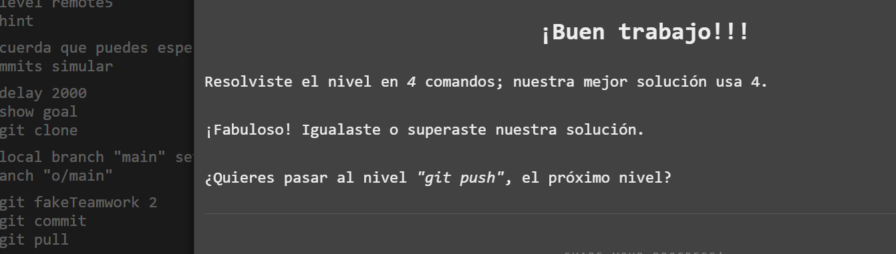

**Aprendizaje:** Se aprendio como se debe colaborar con cambios en el repositorio remoto e integrar lo propio

---

### R1.6 - Git Pushin'

**Objetivo:** Subir commits locales al repositorio remoto para compartir el trabajo.

**Estado inicial:** La rama local `main` tiene commits que `origin` todavía no posee.

| Paso | Comando | Efecto sobre el repositorio |
|---:|---|---|
| 1 | `git commit` | Se crea un commit local. |
| 2 | `git commit` | Se crea un commit local. | 
| 3 | `git push` | Envía los commits nuevos de `main` hacia `origin/main`, siempre que no exista divergencia; actualiza también la rama de seguimiento remoto `o/main` localmente. |

**Estado final:** `origin` refleja los commits que antes solo existían localmente; `o/main` se sincroniza con el nuevo estado remoto.

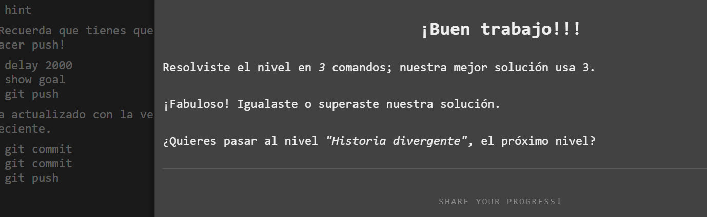

**Aprendizaje:** Se comprendio como subir los commits locales a repositorios remotos

---

### R1.7 - Diverged History

**Objetivo:** Resolver un caso donde tanto el remoto como el repositorio local avanzaron por separado (historial divergente), antes de poder subir cambios.

**Estado inicial:** `main` local tiene commits propios y `origin` también avanzó de forma independiente (simulado con `git fakeTeamwork`).

| Paso | Comando | Efecto sobre el repositorio |
|---:|---|---|
| 1 | `git fakeTeamwork` | Se crea el espacio de trabajo simulado. |
| 2 | `git commit` | Se crean los commits locales. |
| 3 | `git pull --rebase` | Se descarga el commit del companero y se hace rebase del propio. |
| 4 | `git push` | Sube el historial reconstruido a `origin`, que ahora puede aceptarlo porque ya no hay divergencia respecto a lo que el remoto conoce. |

**Estado final:** `origin` y `main` quedan sincronizados con un historial lineal que incorpora el trabajo de ambos orígenes.

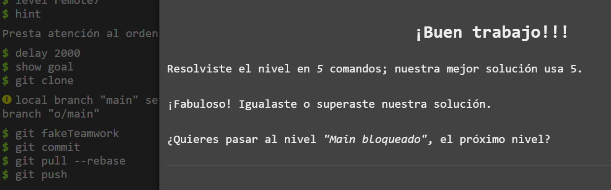

**Aprendizaje:** Se comprendieron las base minimas para resolver un conflcto

---

### R1.8 - Locked Main

**Objetivo:** Practicar cómo integrar cambios remotos cuando la rama principal está protegida y solo se permite agregar commits, no reescribir el historial remoto ya publicado.

**Estado inicial:** `origin` avanzó con commits simulados; `main` local también tiene commits propios.

| Paso | Comando | Efecto sobre el repositorio |
|---:|---|---|
| 1 | `git reset o/main` | Mueve el puntero de la rama local activa de vuelta al estado conocido de `o/main`, dejando "sueltos" los commits propios (pero sin perderlos, siguen existiendo como objetos). |
| 2 | `git checkout -b feature C2` | Crea una nueva rama `feature` apuntando al commit propio que se quería conservar (identificador según el árbol del nivel), en lugar de forzar `main`. |
| 3 | `git push` (o `git push origin feature`) | Sube la nueva rama `feature` a `origin`, sin necesidad de tocar el historial ya publicado de `main`. |

**Estado final:** El trabajo propio queda publicado en una rama nueva sobre `origin`, respetando que `main` es de solo lectura para el equipo.

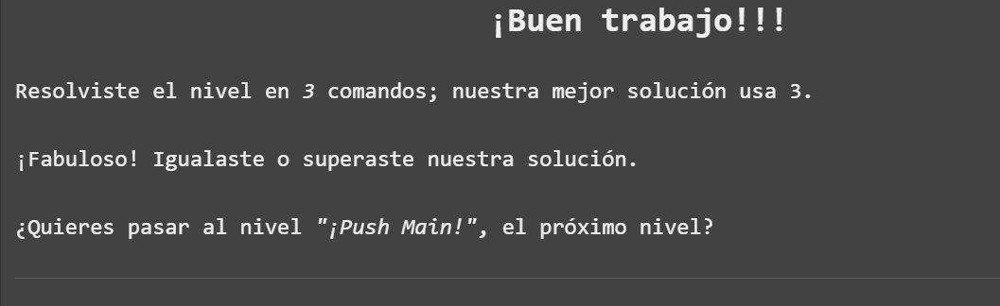

**Aprendizaje:** Se comprendio de manera optima como integrar cambios remotos cuando main esta protegida

---

### R2.1 - Push Main!

**Objetivo:** Integrar el trabajo de varias ramas de funcionalidad hacia `main`, incorporando además cambios que el remoto recibió mientras tanto.

**Estado inicial:** Tres ramas de funcionalidad divergentes entre sí (`side1`, `side2`, `side3`) y un `origin` que avanzó de forma independiente.

| Paso | Comando | Efecto sobre el repositorio |
|---:|---|---|
| 1 | `git fetch` | Actualiza `o/main` con el estado real y más reciente de `origin`. |
| 2 | `git rebase o/main side1` | Reaplica los commits de `side1` sobre la nueva punta de `o/main`. |
| 3 | `git rebase side1 side2` | Reaplica `side2` sobre la nueva punta de `side1`. |
| 4 | `git rebase side2 side3` | Reaplica `side3` sobre la nueva punta de `side2`. |
| 5 | `git rebase side3 main` | Mueve finalmente `main` al extremo de toda la cadena reconstruida. |
| 6 | `git push` | Sube el historial integrado a `origin`. |
 
**Estado final:** `main` incorpora, en orden, el trabajo de las tres ramas de funcionalidad más lo que ya existía en el remoto; `origin` queda sincronizado.

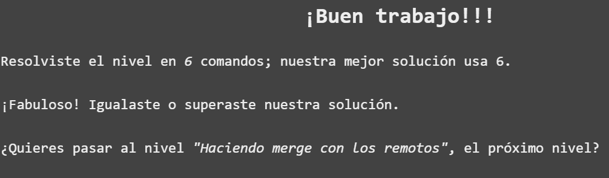

**Aprendizaje:** Se comprendio de mejor como se integra el trabajo de varias ramas y aceptando cambios realizados en el remoto

---

### R2.2 - Merging with remotes

**Objetivo:** Resolver el mismo problema del nivel anterior, pero usando `merge` en lugar de `rebase`.

**Estado inicial:** Igual al nivel anterior: tres ramas de funcionalidad y un remoto actualizado.

| Paso | Comando | Efecto sobre el repositorio |
|---:|---|---|
| 1 | `git checkout main` | Se posiciona sobre `main`. |
| 2 | `git pull origin main` | Descarga e integra el estado más reciente de `origin/main`. |
| 3 | `git merge side1` | Fusiona `side1` en `main`, generando un commit de fusión. |
| 4 | `git merge side2` | Fusiona `side2` en `main`. |
| 5 | `git merge side3` | Fusiona `side3` en `main`. |
| 6 | `git push origin main` | Sube el resultado, con todos los commits de fusión, a `origin`. |
 
**Estado final:** `main` incorpora el trabajo de las tres ramas mediante commits de fusión explícitos (historial no lineal, a diferencia de R2.1).

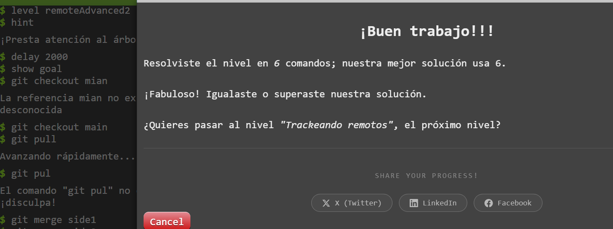

**Aprendizaje:** Se comprendio de mejor manera como se fusionan las ramas desde el remoto al local sin problemas

---

### R2.3 - Remote Tracking

**Objetivo:** Configurar relaciones de seguimiento (*tracking*) entre una rama local y una remota, para que `pull` y `push` sepan a dónde apuntar por defecto.

**Estado inicial:** Repositorio clonado, sin ramas locales adicionales con tracking configurado.

| Paso | Comando | Efecto sobre el repositorio |
|---:|---|---|
| 1 | `git checkout -b side o/main` | Crea la rama local `side` a partir de `o/main`, con seguimiento (*tracking*) configurado automáticamente hacia ella. |
| 2 | `git commit` | Crea un commit sobre `side`. |
| 3 | `git pull --rebase` | Como `side` sigue a `o/main`, el comando sabe automáticamente contra qué remoto sincronizar sin necesidad de especificarlo. |
| 4 | `git push` | Sube `side` a su rama remota asociada, también sin necesidad de indicar remoto ni rama de destino explícitamente. |
 
**Estado final:** `side` queda vinculada de forma permanente a `o/main` (o a la rama remota que corresponda), permitiendo usar `pull`/`push` sin argumentos.

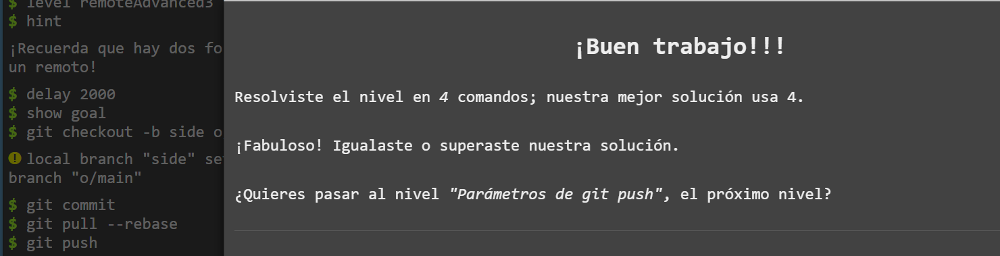

**Aprendizaje:** Se vieron las relaciones de seguimiento logrando entender donde apuntan pull y push

---

### R2.4 - Git push arguments

**Objetivo:** Practicar la sintaxis `git push <remoto> <origen>:<destino>` para enviar una rama local a una rama remota con un nombre distinto.

**Estado inicial:** Ramas locales `main` y `foo` con commits que `origin` no tiene.

| Paso | Comando | Efecto sobre el repositorio |
|---:|---|---|
| 1 | `git push origin main` | Envía la rama `main` local hacia `origin/main`. |
| 2 | `git push origin foo` | Envía la rama `foo` local hacia una rama del mismo nombre en `origin` (creándola si no existe). |
 
**Estado final:** `origin` gana tanto los commits de `main` como una nueva rama `foo` con el contenido de la rama local homónima.
 
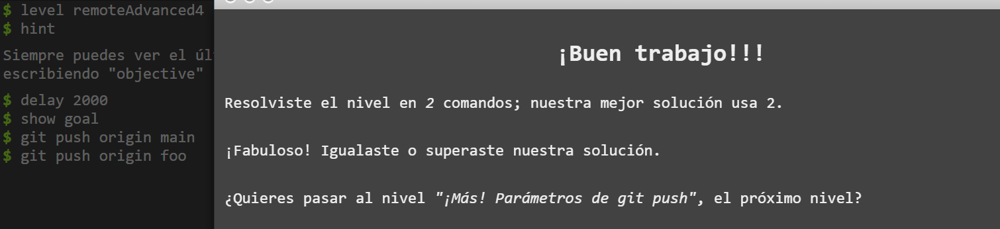

**Aprendizaje:** Se mejoro de manera considerada la sintaxis de git push enviando asi lo que se requiera segun el caso

---

### R2.5 - Git push arguments - Expanded!

**Objetivo:** Extender el uso de argumentos de `push`, incluyendo el borrado remoto de una rama mediante el lado izquierdo vacío.

**Estado inicial:** `main` local con commits adicionales respecto a `origin`.

| Paso | Comando | Efecto sobre el repositorio |
|---:|---|---|
| 1 | `git push origin main^:foo` | Envía el padre del commit al que apunta `main` (no el último commit) hacia una nueva rama `foo` en `origin`. |
| 2 | `git push origin foo:main` | Envía el contenido de la rama local `foo` hacia la rama `main` en `origin`, aunque los nombres de origen y destino sean distintos. |
 
**Estado final:** `origin` gana una rama `foo` basada en un commit intermedio, y su rama `main` queda actualizada con el contenido de la `foo` local.

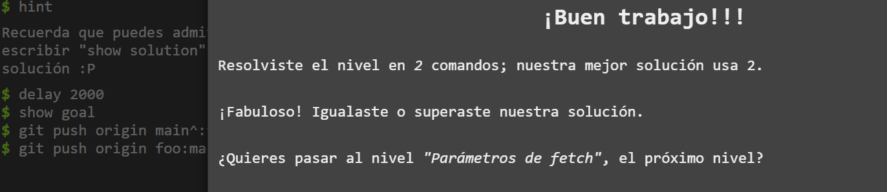

**Aprendizaje:** Se mejoro eluso del git push incluyendo los argumentos basicos y el borrado de una rama.

---

### R2.6 - Fetch arguments

**Objetivo:** Practicar `git fetch <remoto> <origen>:<destino>` para traer una rama remota específica hacia una rama local determinada.

**Estado inicial:**  `origin` tiene commits que no existen localmente en ciertas ramas.

| Paso | Comando | Efecto sobre el repositorio |
|---:|---|---|
| 1 | `git fetch origin C3:foo` | Descarga el commit `C3` de `origin` y lo coloca directamente en una rama local nueva llamada `foo`. |
| 2 | `git fetch origin C6:main` | Descarga el commit `C6` de `origin` y actualiza directamente la rama local `main` con él (sin pasar por `o/main`). |
| 3 | `git checkout foo` | Cambia `HEAD` a la rama recién creada `foo`. |
| 4 | `git merge main` | Fusiona el contenido de `main` (ya actualizada) dentro de `foo`. |
 
**Estado final:** Ambas ramas locales quedan actualizadas con contenido específico traído directamente del remoto, sin pasar por la rama de seguimiento genérica `o/main`.

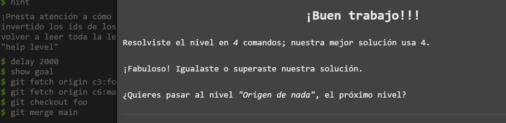

**Aprendizaje:** Se mejoro el uso del comando git fetch por medio del uso de sus argumentos trayendo asi ramas remotas a las locales.

---

### R2.7 - Source of nothing

**Objetivo:** Comprender que dejar vacío el lado de origen en `fetch` o `push` permite borrar referencias remotas o crear ramas vacías, según el caso.

**Estado inicial:** `origin` tiene una rama `foo` que ya no se necesita.

| Paso | Comando | Efecto sobre el repositorio |
|---:|---|---|
| 1 | `git push origin :foo` | Borra la rama `foo` en `origin`, ya que no se especifica una rama local de origen. |
| 2 | `git fetch origin :bar` | Crea una rama local `bar` sin contenido asociado a ningún commit remoto en particular, ilustrando la simetría de la sintaxis `origen:destino` en ambos comandos. |
 
**Estado final:** Se elimina la rama remota `foo` y se crea la rama local vacía `bar`, demostrando el significado de dejar un lado vacío en la sintaxis de refspec.

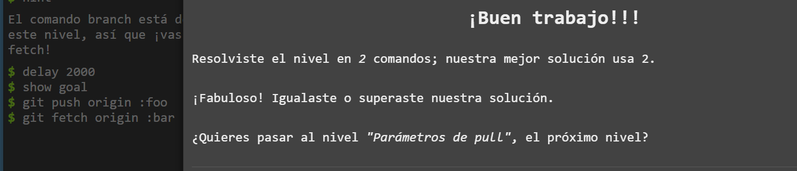

**Aprendizaje:** Se loro borrar referencias remotas y crear ramas vacias segun a como corresponda

---

### R2.8 - Pull arguments

**Objetivo:** Practicar `git pull <remoto> <origen>:<destino>` para combinar fetch y merge con control explícito de qué commit y qué rama local se ven afectados.

**Estado inicial:** `origin` tiene commits específicos que se desean integrar directamente en ramas locales distintas.

| Paso | Comando | Efecto sobre el repositorio |
|---:|---|---|
| 1 | `git pull origin C3:foo` | Descarga el commit `C3` de `origin` y lo fusiona directamente contra la rama local `foo` (creándola si no existe), en un solo comando. |
| 2 | `git pull origin C2:side` | Descarga el commit `C2` de `origin` y lo fusiona directamente contra la rama local `side`. |
 
**Estado final:** Ambas ramas locales quedan actualizadas con el contenido remoto solicitado, sin pasos intermedios de fetch + merge por separado.

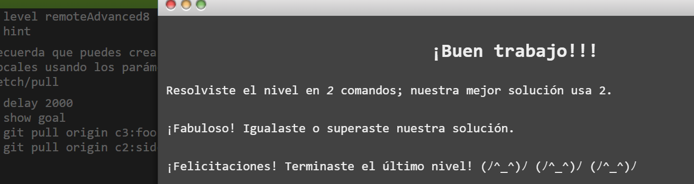

**Aprendizaje:** Se mejoro el uso de git pull combinandolo con comandos extra

---

## Mapas de progreso

**Mapa completo de `Main`:**

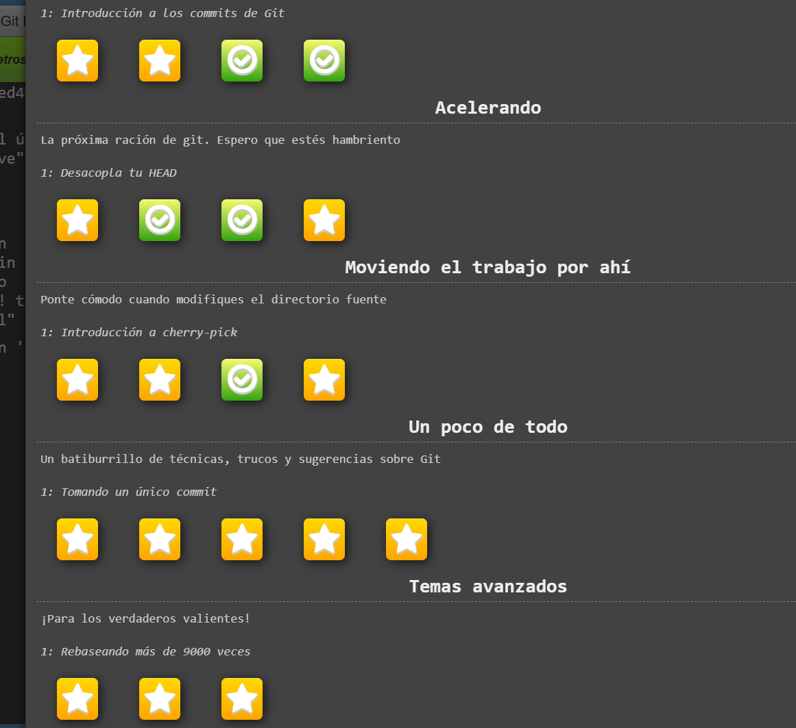

**Mapa completo de `Remote`:**

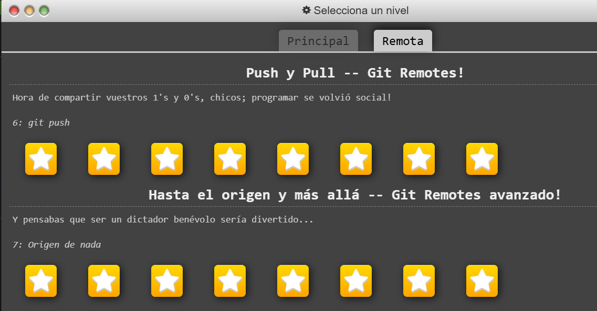

## Tabla resumen de niveles completados

| ID | Nivel | Completado |
|---|---|---|
| M1.1 | Introduction to Git Commits | Sí |
| M1.2 | Branching in Git | Sí |
| M1.3 | Merging in Git | Sí |
| M1.4 | Rebase Introduction | Sí |
| M2.1 | Detach yo' HEAD | Sí |
| M2.2 | Relative Refs (^) | Sí |
| M2.3 | Relative Refs #2 (~) | Sí |
| M2.4 | Reversing Changes in Git | Sí |
| M3.1 | Cherry-pick Intro | Sí |
| M3.2 | Interactive Rebase Intro | Sí |
| M4.1 | Grabbing Just 1 Commit | Sí |
| M4.2 | Juggling Commits | Sí |
| M4.3 | Juggling Commits #2 | Sí |
| M4.4 | Git Tags | Sí |
| M4.5 | Git Describe | Sí |
| M5.1 | Rebasing over 9000 times | Sí |
| M5.2 | Multiple parents | Sí |
| M5.3 | Branch Spaghetti | Sí |
| R1.1 | Clone Intro | Sí |
| R1.2 | Remote Branches | Sí |
| R1.3 | Git Fetchin' | Sí |
| R1.4 | Git Pullin' | Sí |
| R1.5 | Faking Teamwork | Sí |
| R1.6 | Git Pushin' | Sí |
| R1.7 | Diverged History | Sí |
| R1.8 | Locked Main | Sí |
| R2.1 | Push Main! | Sí |`
| R2.2 | Merging with remotes | Sí |
| R2.3 | Remote Tracking | Sí |
| R2.4 | Git push arguments | Sí |
| R2.5 | Git push arguments - Expanded! | Sí |
| R2.6 | Fetch arguments | Sí |
| R2.7 | Source of nothing | Sí |
| R2.8 | Pull arguments | Sí |

## Síntesis de conceptos aprendidos (400-600 palabras)

A lo largo de la resolución de los 34 niveles de Learn Git Branching se aprendió, paso a paso, el funcionamiento interno de Git, partiendo de lo básico hasta los conceptos más complejos de trabajo remoto.

En la sección Main, primero se aprendió a realizar un commit básico y cómo se ve reflejado en el historial, sentando la base para crear ramas. Se adquirieron las bases para entender lo que es mergear, y se comprendió cómo juntar el trabajo de varias ramas mediante el rebase. Se comprendió cómo funciona el HEAD y cómo moverlo a un commit en particular, además de aprender a trasladar las ramas utilizando el símbolo ^. Se logró implementar las referencias relativas junto con la bandera -f, y se comprendió la diferencia entre deshacer cambios de forma local y de forma remota.

Conforme avanzaron los niveles, se comprendió cómo tomar copias de commits sin fusionar todo el árbol, y se aprendió a agrupar commits en un orden conveniente mediante el rebase interactivo, fortaleciendo lo aprendido sobre el rebase iterativo y el normal, aunque en algunos niveles hubo dificultades por lo extenso del árbol. Se aprendió el principio básico de los tags y su utilidad, y se reconoció el valor del comando describe. En los niveles avanzados se mejoró la forma de iterar sobre las ramas, se aprendió a crear y mover una rama de forma más compleja, y se logró entender a profundidad cómo tratar los commits.

Ya en la sección Remote, se aprendió el proceso de clonado de un repositorio remoto y cómo actualizar commits en ramas remotas. Se entendió el efecto del comando fetch evitando la fusión automática con lo local, y se comprendió cómo realizar el refrescamiento de un repositorio mediante pull. Se aprendió cómo colaborar con cambios en el repositorio remoto e integrar lo propio, y cómo subir los commits locales al remoto. Se comprendieron las bases para resolver un conflicto de historial divergente, e integrar cambios remotos cuando main está protegida.

En los últimos niveles se comprendió cómo se integra el trabajo de varias ramas aceptando cambios del remoto, con rebase o con merge. Se vieron las relaciones de seguimiento, entendiendo hacia dónde apuntan pull y push, y se mejoró la sintaxis de git push, incluyendo sus argumentos y el borrado de una rama. Se mejoró también el uso de git fetch mediante argumentos, trayendo ramas remotas a las locales, y se logró borrar referencias remotas y crear ramas vacías según corresponda. Por último, se mejoró el uso de git pull combinándolo con comandos extra, cerrando el recorrido por los 34 niveles.

---

## Análisis obligatorio de Git 

1. **¿Cuál es la diferencia entre `merge` y `rebase`? ¿Qué ocurre con el historial en cada caso?**
   `merge` crea un commit nuevo con dos padres que une dos historiales divergentes sin alterar los commits existentes. `rebase` reescribe el historial creando copias de los commits sobre una nueva base, produciendo un historial lineal pero cambiando los identificadores de los commits reaplicados, esto se vio evidenciado en el nivel M1.4 pues el arbol del grafico paso de tener dos bifurcaciones a estat lineal. 

2. **¿Cuándo conviene utilizar `reset` y cuándo `revert`?**
   `reset` conviene cuando los commits a deshacer son puramente locales y no se han compartido, porque reescribe el historial. `revert` conviene cuando los commits ya fueron compartidos con otras personas, porque agrega un commit nuevo que anula el cambio sin alterar el historial existente. Esto se fundamenta en el nivel M2.4 debido que local se retrocede hasta main con un reset haciendo referencia a que no esta compartida mientras que la rama pushed hace un rever.

3. **¿Qué significa tener `HEAD` separado o *detached*?**
   Significa que `HEAD` apunta directamente a un commit en lugar de a una rama. En ese estado, nuevos commits no quedan asociados a ninguna rama a menos que se cree una explícitamente. Especificamente en el nivel M2.1 se mueve la posicion del HEAD desde bugFix hasta el commit C4.

4. **¿Qué diferencia existe entre una rama local, una rama remota y una rama de seguimiento remoto?**
   Una rama local es un puntero que se mueve con los commits del propio repositorio. Una rama remota vive en el repositorio `origin`. Una rama de seguimiento remoto (por ejemplo `o/main`, prefijo usado por el simulador para representar `origin/main`) es una copia local de dónde estaba la rama remota la última vez que se sincronizó (`fetch`/`clone`/`push`), y solo se actualiza con esas operaciones. En el nivel R1.2 se observa especifcamente como el flujo de una rama local y laremota es muy distinto pues se deben tener mas cuidados en una que en otra.

5. **¿Qué hacen individualmente `fetch`, `merge`, `pull` y `push`?**
   `fetch` descarga commits nuevos del remoto y actualiza las ramas de seguimiento remoto, sin tocar el trabajo local. `merge` combina dos historiales en un commit de fusión. `pull` es `fetch` + `merge` en un solo paso. `push` envía commits locales hacia el remoto, lo anterior queda demotrado en el flujo de los nivel R1.1-R1.6, los cuales son las bases para estos conceptos.

6. **¿Qué riesgos existen al reescribir un historial que ya fue compartido?**
   Reescribir commits ya publicados (por ejemplo con `rebase` o `reset` seguido de push forzado) puede generar divergencia irreconciliable para quienes ya basaron su trabajo en los commits originales, obligándolos a resolver conflictos manualmente o perder cambios. El nivel R1.8 muestra por qué conviene evitar reescribir historial remoto ya compartido logrando un flujo grafico en el trabajo entendible en el cual los miembros se aportan mutuamente.

7. **¿Para qué resultan útiles `cherry-pick`, las referencias relativas y los tags?**
   `cherry-pick` permite traer commits puntuales sin fusionar toda una rama. Las referencias relativas (`^`, `~num`) permiten navegar el árbol sin memorizar hashes completos. Los tags marcan puntos fijos e inmutables del historial, útiles para versiones de software, y `git describe` permite ubicar cualquier commit respecto al tag más cercano.

8. **¿Qué diferencias identificó entre el simulador y un repositorio Git real?**
   Learn Git Branching usa identificadores cortos y secuenciales  en lugar de los hashes SHA-1 reales de Git, lo que facilita la lectura pero no refleja el formato real de los commits. También usa el prefijo `o/` como abreviatura visual de `origin/` para las ramas de seguimiento remoto. Además, incluye comandos de simulación que no existen en Git real, como `git fakeTeamwork`, usado únicamente para generar commits remotos ficticios con fines pedagógicos, del mismo modo se noto que no era posible tener conflictos a como si lo ocurre en repositorios compartidos.
