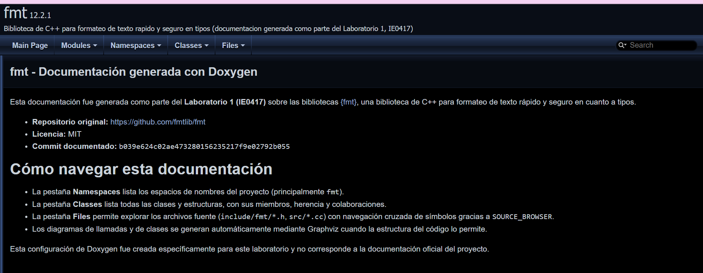
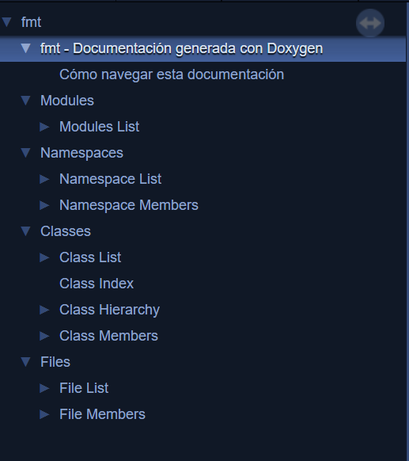
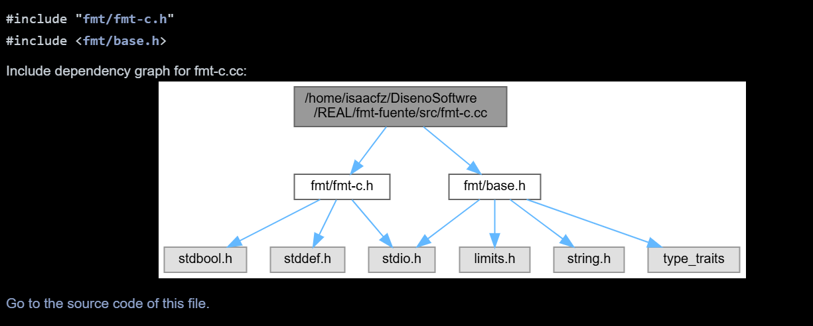
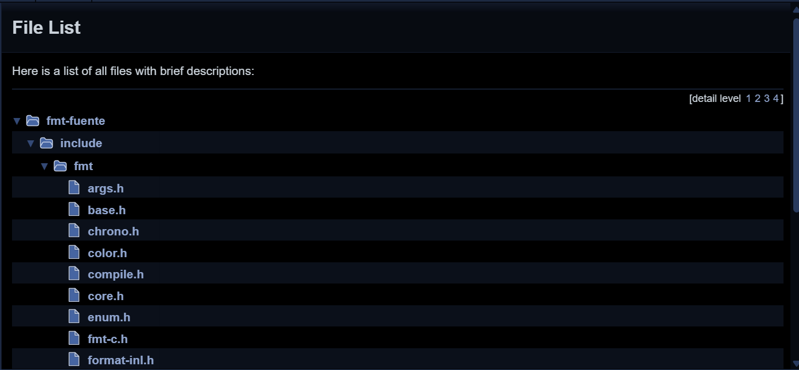
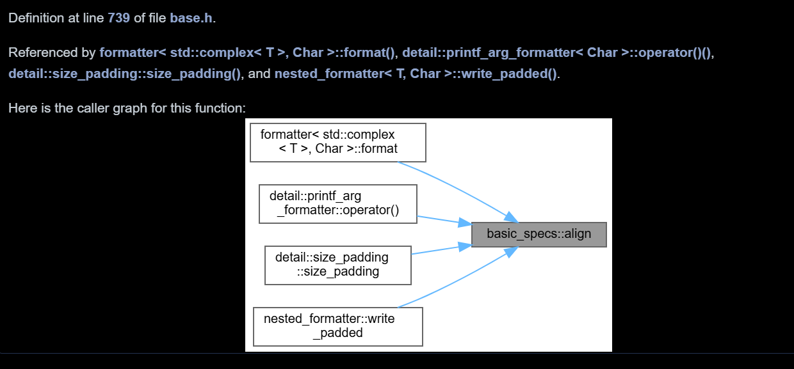
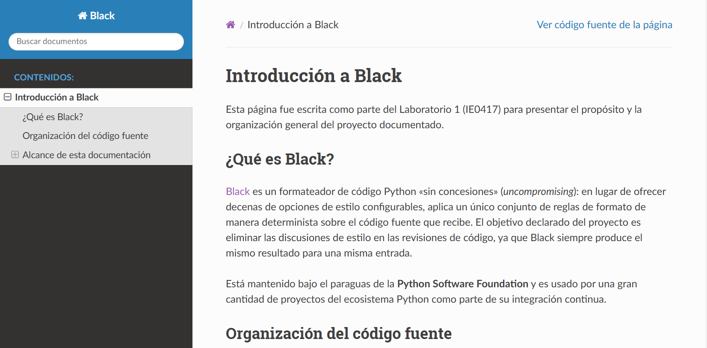
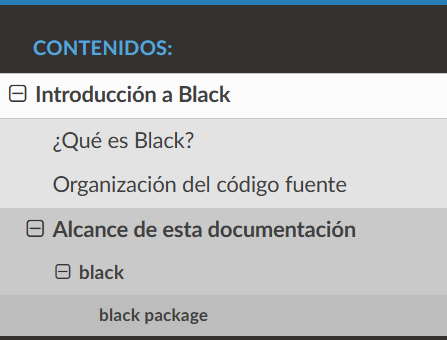
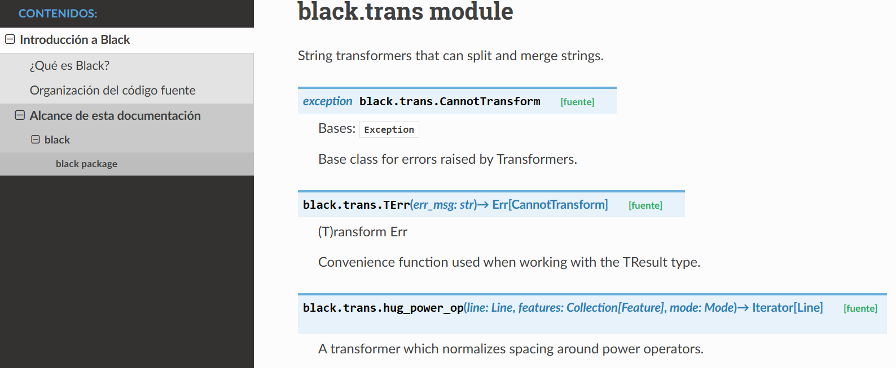
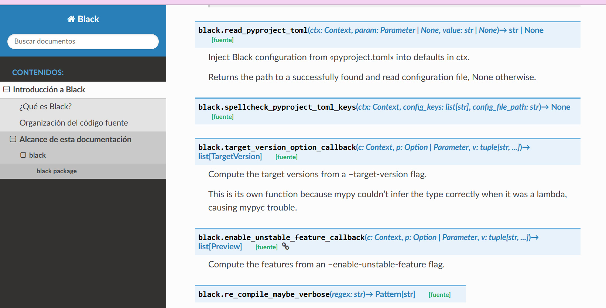

# Informe - Laboratorio 1 (IE0417)

## 7.3 Análisis de la documentación generada con Doxygen ({fmt})

1. **Qué muestra la página principal y cómo está organizada la navegación**
   [Al ingresar en la página principal, se observa el título del proyecto en el que se basó. Del mismo modo, se muestra una breve descripción de cómo se debe navegar dentro de la página; esta misma está organizada por medio de un árbol de contenidos, el cual se observa en la izquierda de la página.]

2. **Qué información se genera para clases, estructuras, espacios de nombres, archivos y funciones.**
   [Si se ingresa a la sección de clases, se puede observar la estructura de las mismas, sus miembros, herencias y colaboradores. Por otro lado, las funciones están más asociadas a sus espacios de nombres, donde se genera la información más a detalle sobre las características de cada una. La sección de archivos permite el ingreso a la información del proyecto (archivos .cc y .h), donde se hacen las declaraciones que le dan vida a todo. Por último, los espacios de nombres representan los espacios de nombres del proyecto, principalmente fmt, y dentro de ellos podemos encontrar funciones, estructuras, clases, entre otros.]

3. **Cómo se presentan parámetros, valores de retorno, miembros, herencia y relaciones.**
   [Los parámetros son mostrados con sus características, como lo son el tipo y el nombre. Por otro lado, los valores de retorno muestran el tipo de retorno que se tendrá según el caso, y a veces con una explicación del mismo. Los miembros se presentan separados por clases, como public types y public members, de modo que se muestra lo que estos heredan según a lo que estén relacionados.]

4. **Qué diagramas o referencias cruzadas se generaron y qué permiten comprender.**
   [Se muestran una especie de diagramas de bloques llamados call graph, donde se muestran las funciones o métodos que llaman a otra función y qué otras llama esta función a su vez.]

5. **Qué parte de la documentación proviene de comentarios estructurados y qué parte puede inferir Doxygen del código.**
   [La portada que se muestra fue creada con comentarios estructurados (mainpage.md); lo demás fue inferido por Doxygen del código.]

6. **Qué puede aprender una persona desarrolladora nueva sobre el proyecto gracias a esta documentación**
   [Una persona aprendería cómo está construido el proyecto en C++, desde sus estructuras, clases y funciones; y no solo lo que son, sino también cómo se usan estas, cuándo se usan, qué hay dentro de cada una, y algo de suma importancia: dónde se encuentran implementadas dentro del proyecto.]

7. **Qué elementos quedaron incompletos, poco claros o sin documentar, y por qué.**
    [Algunas funciones únicamente se muestran con su nombre y lo demás en blanco; esto se puede deber a que el programador no agregó los comentarios necesarios para que se generara su documentación, lo cual provoca que, para una persona externa al proyecto, sea difícil comprender qué parámetros usa, para qué sirve, cuándo utilizarla, entre otras características importantes. Del mismo modo, puede ocurrir que no se hayan generado determinados gráficos sobre las clases y funciones, pero eso no quiere decir que esa parte en específico del código no tenga relación con otra; únicamente puede atribuirse a una falla en Doxygen a la hora de generar el gráfico, por lo cual no queda claro si es una falla o si de verdad no se tiene ninguna relación.]

**Capturas:**






---

## 8.4 Análisis de la documentación generada con Sphinx (Black)

> Navegá tu propio sitio en https://monumental-lokum-aedc73.netlify.app/python/ y respondé con base en lo que realmente viste. Incluí al menos 5 capturas de pantalla como evidencia.

1. **Qué muestra la portada y cómo funciona el `toctree`.**
   [La portada muestra el repositorio original, la licencia empleada y el commit documentado; del mismo modo, se muestra el toctree, el cual es jerárquico, es decir, no aparece toda la información de la página desde el inicio, sino que se debe ir haciendo clic en este para ir desbloqueando nuevas secciones.]

2. **Cómo se representan los paquetes, módulos, clases, funciones y métodos.**
   [Los paquetes son presentados mediante un índice, y dentro de ese se encuentran sus módulos, por lo tanto se puede ver la estructura modular del paquete Black. Por otro lado, las clases se ven dentro de una página de módulo; la documentación indica el tipo de las mismas. Las funciones aparecen con el módulo al que pertenecen, y los métodos asociados a su clase. Algo importante de destacar es que el índice permite diferenciar los métodos de las funciones de módulo.]

3. **Qué contenido se obtuvo automáticamente de firmas y *docstrings*.**
   [Los tipos bool y el retorno salieron automáticos de los comentarios generados de Black, no de un docstring escrito.]

4. **Qué contenido narrativo fue escrito manualmente y por qué era necesario.**
   [Se agregó una breve descripción de lo que es Black y su filosofía. Del mismo modo, se agruparon los 23 módulos que sphinx-apidoc lista en orden alfabético, y por último se hizo la aclaración de que algunos módulos quedan fuera del alcance de la documentación.]

5. **Cómo se presentan parámetros, tipos, retornos, excepciones, índices, búsqueda y enlaces al código.**
   [Los parámetros y tipos se muestran dentro de la firma, lo que permite saber el nombre del parámetro, el tipo y su retorno. Los retornos se muestran con una flecha (->), y en algunos casos se explica su significado. Las excepciones se muestran con sus clases base. Por otro lado, los índices están divididos en dos mecanismos importantes: el índice general y el índice de módulos. Las búsquedas se incluyen en la portada, donde se tiene un espacio para buscar documentos. Por último, los enlaces aparecen marcados de color celeste y llevan a las páginas donde se detalla la información del mismo.]

6. **Qué puede aprender una persona usuaria o desarrolladora nueva sobre el proyecto.**
   [Aprendería la base de lo que es Black por medio de la introducción y cuál es su propósito, la organización del proyecto, la función que cumple cada módulo, cómo usar determinadas funciones, qué parámetros se necesitan, y podría ver todo esto dentro de la documentación por medio de los enlaces.]

7. **Qué elementos quedaron incompletos, poco claros o sin documentar, y por qué.**
    [Hay partes que fueron excluidas al azar; esto se debe al alcance de la documentación, lo cual genera un fallo accidental. Algunas entidades tienen información estructural, pero muy poca información, de modo que la persona puede perder información.]

**Capturas:**





---

## 9. Comparación entre Doxygen y Sphinx

| Dimensión | Doxygen en C++ | Sphinx en Python |
|---|---|---|
| Fuente principal de la información | Análisis estático del código fuente (headers y .cc de fmt); no necesita compilar ni ejecutar el proyecto. | Introspección en tiempo de ejecución vía `autodoc`; necesita **importar** el paquete Python real, por lo que Black tuvo que instalarse junto con sus dependencias (`click`, `packaging`, `pathspec`, etc.) en el entorno virtual antes de generar la documentación. |
| Configuración y proceso de generación | Un único archivo `Doxyfile` con ~2800 opciones (la mayoría por defecto); se corrigió un problema real donde `sed` dejó líneas huérfanas de `FILE_PATTERNS`, lo que generó 165 advertencias falsas hasta limpiarlas. | Configuración repartida en `conf.py` (extensiones, tema, mocks) más `sphinx-apidoc` para generar los stubs de módulos por separado; requiere entorno virtual de Python además de la herramienta en sí. |
| Organización y navegación | Árbol de navegación por Namespaces / Classes / Files, con buscador integrado y vista de código fuente cruzada (`SOURCE_BROWSER`). | Árbol de navegación (`toctree`) jerárquico definido a mano en `.rst`, con buscador integrado y enlaces `[fuente]` (`viewcode`) hacia el código resaltado. |
| Documentación de API | Extraída de comentarios `///` y `/** */` ya presentes en los headers de fmt; con `EXTRACT_ALL=YES` también documenta miembros sin comentario, mostrando solo la firma. | Extraída de las firmas de función con *type hints* (parámetros y retornos tipados) más los docstrings en prosa de Black; sin `EXTRACT_ALL` equivalente, `autodoc` documenta lo que exista en el módulo igual, apoyándose más en los tipos que en el texto. |
| Diagramas y referencias cruzadas | Diagramas de clases y de llamadas (`CALL_GRAPH`/`CLASS_GRAPH`) generados automáticamente en SVG vía Graphviz, visibles en varias páginas de clase. | No genera diagramas gráficos por defecto; las referencias cruzadas son hipervínculos de texto entre símbolos (vía `viewcode` e `intersphinx` si se configurara), no representación visual de relaciones. |
| Contenido narrativo | Limitado a una página principal (`mainpage.md`, escrita para este laboratorio); el resto es documentación de referencia pura. | Página narrativa propia más extensa (`introduccion.rst`) explicando la organización interna en módulos (parsing, generación de líneas, utilidades), además de la referencia de API. |
| Dependencia de comentarios o *docstrings* | Alta calidad de partida: fmt ya usa comentarios Doxygen consistentes en sus headers públicos, por lo que gran parte del trabajo fue extraer, no inferir. | Menor dependencia de docstrings estructurados: los de Black son prosa libre (no siguen formato Google/NumPy), así que `napoleon` aporta poco y la información más confiable sale de los *type hints*, no del texto. |
| Facilidad de mantenimiento | Se actualiza re-ejecutando `doxygen Doxyfile` sin pasos adicionales una vez configurado; no depende de que el proyecto siga instalándose correctamente. | Requiere mantener el entorno virtual y las dependencias de Black instalables (`pip install`) para que `autodoc` pueda importar el paquete; un cambio que rompa el import rompe también la documentación. |
| Audiencia principal | Desarrolladores C++ que ya conocen el proyecto y buscan referencia rápida de una clase o función específica durante la integración de la biblioteca. | Tanto referencia de API como onboarding: la página narrativa está pensada para alguien nuevo que quiere entender la arquitectura antes de leer código. |
| Fortalezas y limitaciones | Fortaleza: no depende de que el código compile o se pueda importar. Limitación: se confunde con metaprogramación de plantillas compleja (advertencias de "relación de clase recursiva"). | Fortaleza: aprovecha el sistema de tipos de Python para documentar sin depender de comentarios. Limitación: depende por completo de poder instalar/importar el paquete y de sus dependencias opcionales (tuvimos que usar `autodoc_mock_imports` para `IPython`, `tokenize_rt` y `aiohttp`). |

1. **¿Cuál herramienta produjo información útil con menos configuración y por qué?**
   Doxygen, porque `EXTRACT_ALL=YES` genera documentación de referencia aprovechable con una sola pasada sobre el código fuente, sin depender de que el proyecto se pueda instalar. Sphinx necesitó un paso adicional obligatorio (crear entorno virtual, instalar Black y sus dependencias) antes de que `autodoc` pudiera generar una sola página.

2. **¿Cuál resultado ayuda mejor a comprender la arquitectura del proyecto?**
   Sphinx, gracias a `introduccion.rst`: es contenido narrativo escrito para explicar cómo se organizan los módulos entre sí (parsing, generación de líneas, utilidades), algo que Doxygen no ofrece salvo que se invierta tiempo extra escribiendo páginas `\mainpage` adicionales por módulo.

3. **¿Cuál resultado ayuda mejor a aprender a utilizar la API?**
   Doxygen, por los diagramas de llamadas y de clases generados automáticamente: ver visualmente qué funciones invoca cada método ayuda a entender el flujo de uso más rápido que solo leer una firma de función con tipos, que es lo máximo que ofrece Sphinx sin diagramas.

4. **¿Qué problemas del código fuente quedaron expuestos al generar la documentación?**
   En fmt, Doxygen expuso patrones de metaprogramación con plantillas recursivas (`make_integer_sequence`) que confunden al analizador estático, generando advertencias de "relación de clase recursiva potencial" — no es un error real, pero sí una señal de la complejidad de plantillas del proyecto. En Black, Sphinx expuso que los docstrings no siguen ningún formato estructurado consistente (ni Google ni NumPy), lo que generó 14 advertencias de `docutils` al intentar interpretarlos como reStructuredText.

5. **¿Qué cambios integraría al flujo de desarrollo para mantener la documentación actualizada?**
   Para fmt: agregar una convención de estilo de comentarios Doxygen obligatoria en las revisiones de código (code review), ya que la calidad de la documentación depende directamente de eso. Para Black: adoptar un formato estructurado de docstrings (Google o NumPy) para que `napoleon` pueda aprovecharlos correctamente en vez de solo depender de los *type hints*.

6. **¿Qué verificaciones automatizaría en integración continua?**
   Correr `scripts/build-docs.sh` en cada *pull request* y hacer fallar el pipeline si el conteo de advertencias en `doxygen/build.log` o `sphinx/build.log` aumenta respecto al commit anterior (regresión de calidad de documentación), además de verificar que ambos comandos terminen con código de salida 0 antes de permitir el merge.

---

## 10.3 Verificación de publicación

| Campo | Valor |
|---|---|
| Fecha y hora de la prueba | 2 de septiembre del 2026 a las 3:34 p. m. |
| Navegador utilizado | Google |
| ¿Ventana privada / sin sesión iniciada? | Sí |
| URL de portada verificada | https://monumental-lokum-aedc73.netlify.app/ |
| URL de Doxygen verificada | https://monumental-lokum-aedc73.netlify.app/cpp/ |
| URL de Sphinx verificada | https://monumental-lokum-aedc73.netlify.app/python/ |

---

## 11. Historial de Git de este repositorio

Salida de `git log --graph --oneline --decorate --all`, capturada el [COMPLETAR: fecha]:

```text
[COMPLETAR: pegar acá la salida completa del comando]
```

[A lo largo del laboratorio se trató de implementar una rama para cada parte del mismo; por ejemplo, la parte de Git tiene su rama, la parte de Doxygen la suya, y así con las demás partes, en las cuales se hacía push de sus modificaciones y, cuando se culminaba esa parte, se hacía un merge a main para contener todos los cambios realizados. Esto se repitió así hasta tener la rama llamada finalización, encargada de subir lo restante y culminar el laboratorio.]

---

## 12. Entregables

| Campo | Valor |
|---|---|
| URL del repositorio de GitHub | https://github.com/CH4CFZ/ie0417-laboratorio-git-documentacion-C32985.git |
| Hash del commit del tag `v1.0-laboratorio` | [COMPLETAR: salida de `git rev-parse v1.0-laboratorio`] |
| URL pública de la portada | https://monumental-lokum-aedc73.netlify.app/ |
| URL directa de la documentación Doxygen | https://monumental-lokum-aedc73.netlify.app/cpp/ |
| URL directa de la documentación Sphinx | https://monumental-lokum-aedc73.netlify.app/python/ |
